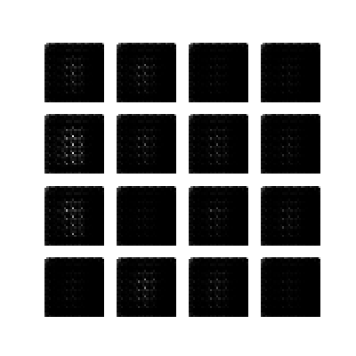

# Tensorflow
Hey! Welcome to my respository where I have tried building a few deep learning models using Tensorflow. I have implemented CNNs, RNNs, and GANs, done some visualizations using Tensorboard, and all tried my hands on Keras and TFLearn.

You will find the following in the respective folders in the repository:
1. Convolutional Neural Networks (CNN): I create a simple CNN on the MNIST dataset that achieves ~98% accuracy on the test set. I use two convolution layers with max pooling and RELU, and two fully connected layers. I use Cross Entropy Loss and Adam Optimizer. Finally, I show visualizations using Tensorboard. 
2. Recurrent Neural Networks (RNN): I create an encoder-decoder model with attention for translating Spanish sentences to English. The code is from the [Tensorflow Neural Machine Translation tutorial](https://github.com/tensorflow/nmt).
3. Generative Adversarial Networks (GAN): I create a DCGAN to generate digits using the MNIST dataset. The Generator and Discriminator consist of convolution and convolution transpose layers. The code is from the [Tensorflow tutorial on DCGAN](https://github.com/tensorflow/tensorflow/blob/r1.13/tensorflow/contrib/eager/python/examples/generative_examples/dcgan.ipynb)

4. Keras: I create a CNN for classifying MNIST dataset using Keras. The model consists of two convolution with max pooling and RELU, and two fully connected layers. I use Cross Entropy loss and Adam optimizer. 
5. TFLearn: I create a network similar to Keras, but using TFLearn. I also show the visualizations in Tensorboard.