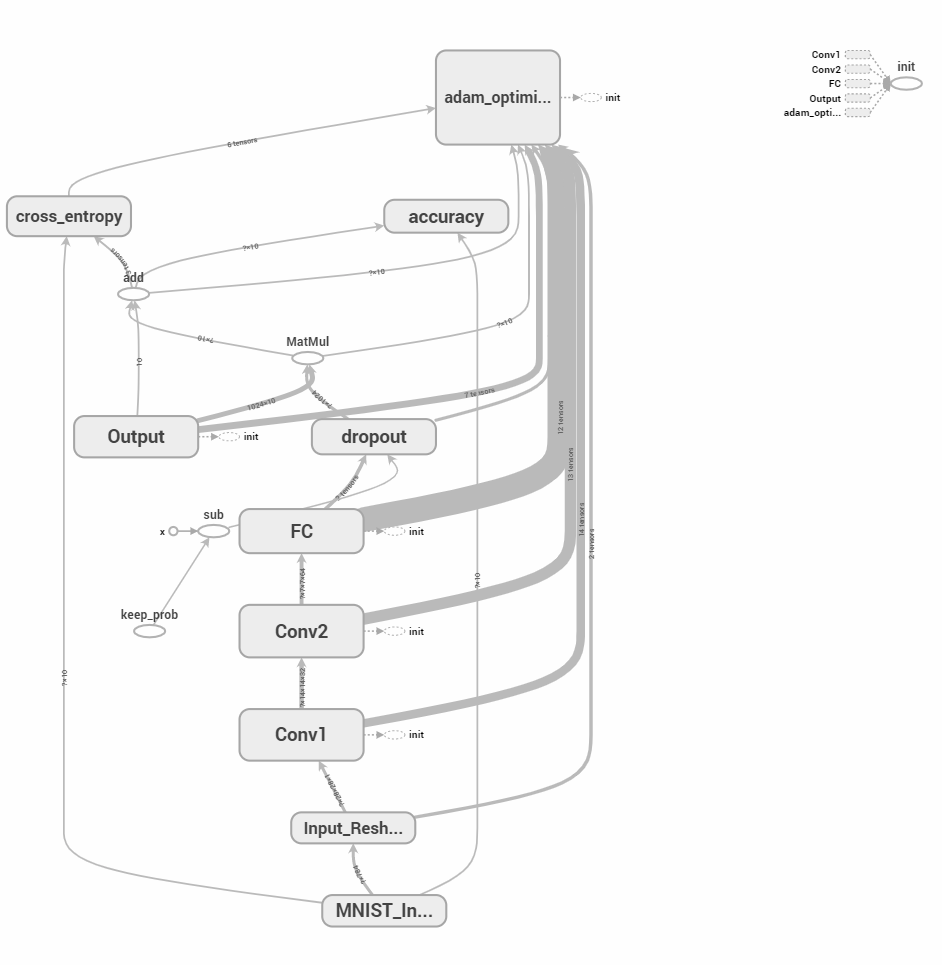
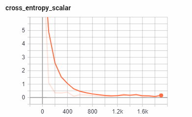
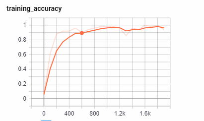
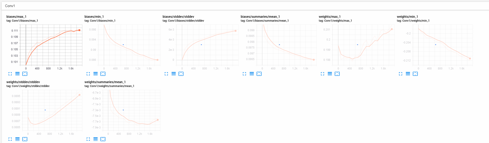
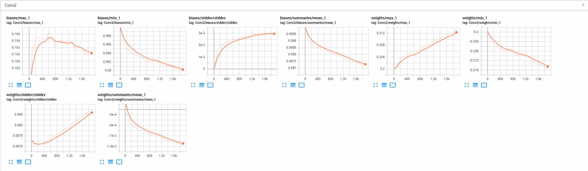
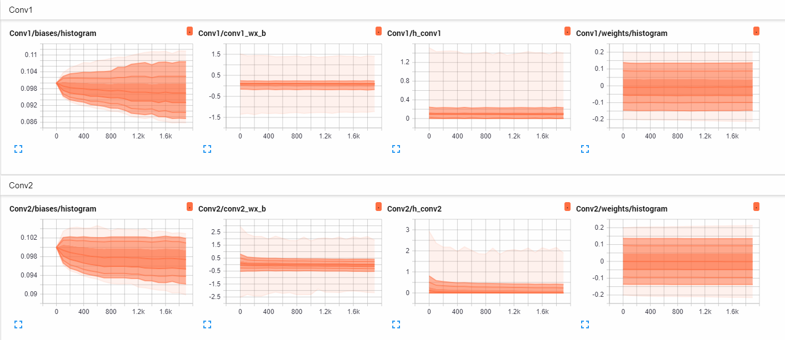
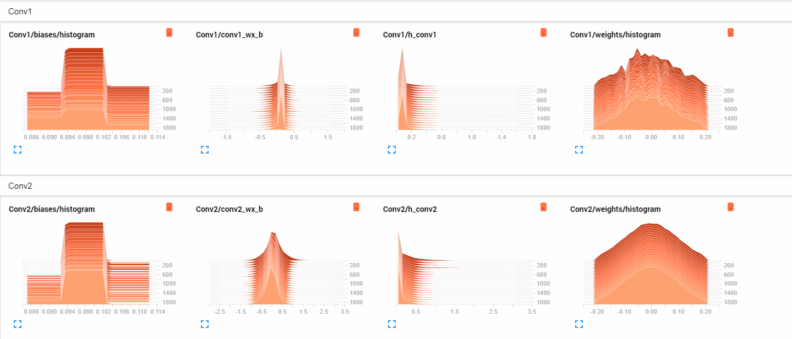

# CNNs using Tensorflow
I create a simple CNN for MNIST dataset. The model consists of two convolutional layers, each with a 5 X 5 kernel, with RELU activation followed by max pooling. Finally, I use two fully connected layers, the first has RELU activation and a dropout with drop probability of 20%. I use cross entropy loss and Adam optimizer as the optimizer of choice. The model achieves a test accuracy of ~98% on the test data. Here is the computation graph using Tensorboard:

I also generate visualizations for each of the layers using Tensorboard . Have a look at a few of the generated visualizations:

