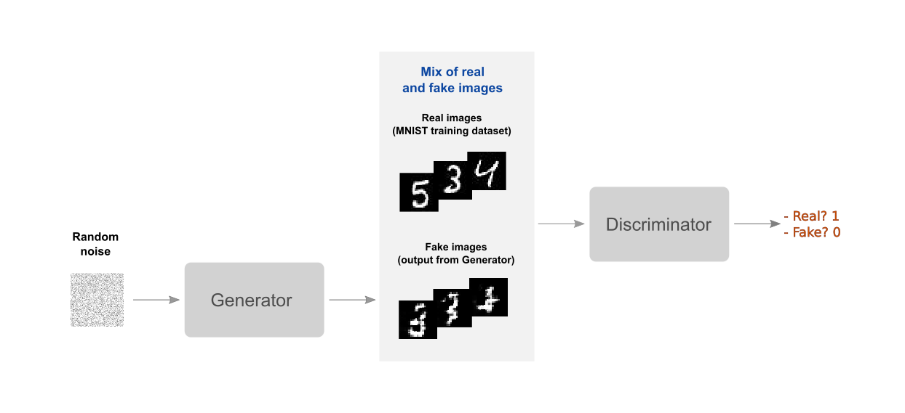
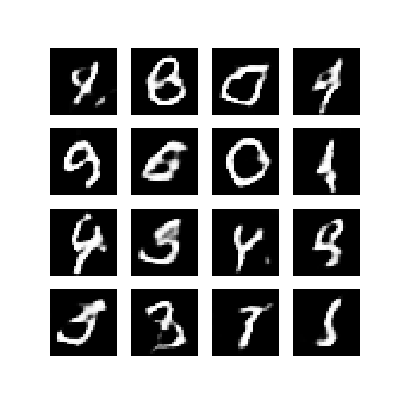

# GAN using Tensorflow
I develop a GAN that generates digits based on MNIST dataset. I build DCGAN (deep convolutional generative adversarial network) using Keras based on the [Tensorflow tutorial](https://github.com/tensorflow/tensorflow/blob/r1.13/tensorflow/contrib/eager/python/examples/generative_examples/dcgan.ipynb). 

The Generator network consists of four convolution transpose layers for upsampling. The first three layers have batch normalization and leaky RELU as the activation function. The final layer uses tanh activation. The Discrimator network is a simple CNN classifier with two convolution layers with dropout and leaky RELU activation, and a final fully connected layer. I use Adam optimizer for both Generator and Discriminator, and use sigmoid + cross entropy method for loss computation.

After training for 50 epochs, the Generator generates the below images:

Overall, the change from epoch 1 to epoch 50 is depicted by the below GIF:

