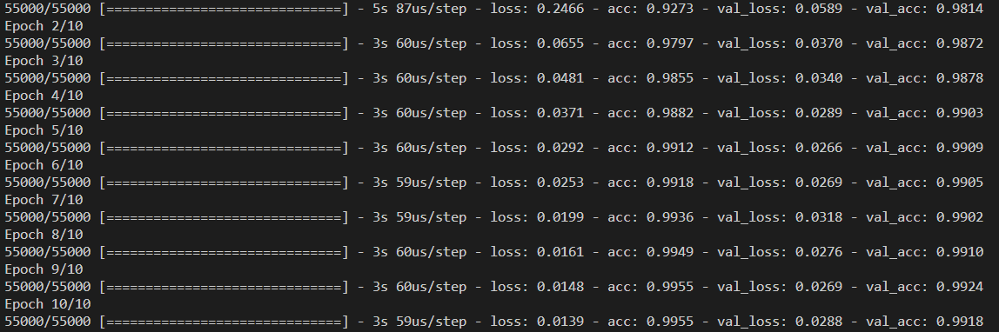

# Keras and Tensorflow
I create a CNN classifier for MNIST dataset on Keras. I use two convolution layers with small sized kernels of size 3 X 3 with RELU activation and max pooling, and two fully connected layers. The first one uses RELU activation and dropout with drop probability of 20%. The final layer has a softmax for 10 classes. 

I use cross entropy as the loss function and Adam as the optimizer of choice. After training for 10 epochs, the model achieves an accuracy of 99.18%.

