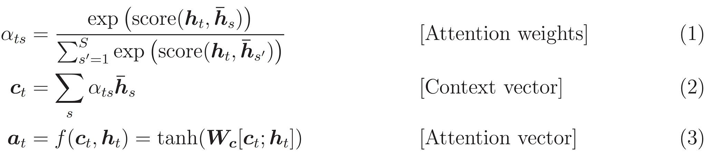

# Sequence to Sequence model using Tensorflow
I create a sequence to sequence model with attention using Tensorflow. The code is based on this [Tensorflow tutorial](https://github.com/tensorflow/tensorflow/blob/r1.13/tensorflow/contrib/eager/python/examples/nmt_with_attention/nmt_with_attention.ipynb). I use the model to generate English translations of Spanish sentences, based on dataset provided by http://www.manythings.org/anki/. I follow these steps for data preparation:
1. Add start and end token
2. Remove special characters
3. create dictionaries for word to id mapping and id to word mapping
4. Pad each sentence to maximum length

The model implements these attention equations:

The encoder consists of a GRU, while the decoder consists of a fully connected layers and weights for attention computation and a GRU and a fully connected layer for the output.  The training steps are as follows:
1. Pass the Input to Encoder to get Encoder Output and Encoder Hidden State
2. Pass Encoder Output, Encoder Hidden State and Decoder Input (starting with Start token) to Decoder to get Decoder Predictions and Decoder Hidden State
3. The Decoder Hidden State is passed back to model, while Decoder Predictions is used calculate loss
4. I use Teacher forcing, i.e. pass target word as next input.

To reduce the training time, I limit the dataset to 30000 examples. I train the model for 10 epochs. While translating I follow the below steps:
1. Dont use teacher forcing
2. Previous prediction by Decoder, Decoder Hidden State and Encoder Output goes as Input to the Decoder
3. Stop when END token is predicted
4. Store attention weights

We run the model on four sentences to get below translations:

The generated attention weights for each of these sentences are below:

