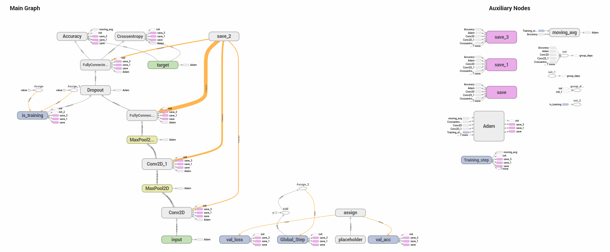
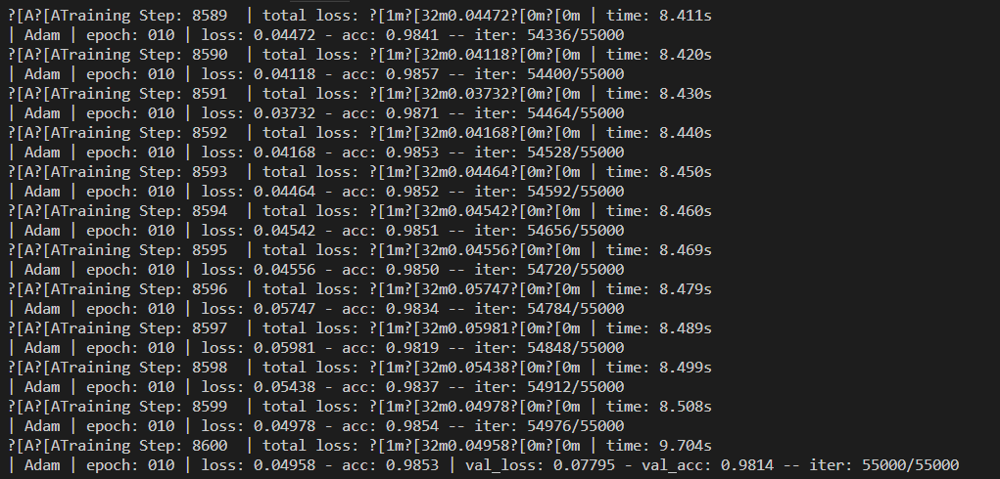
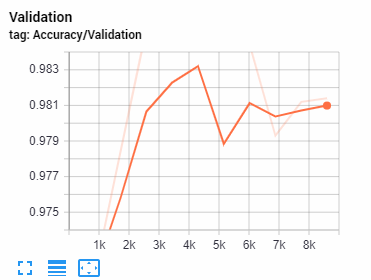
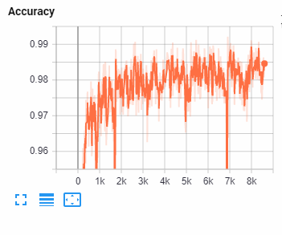
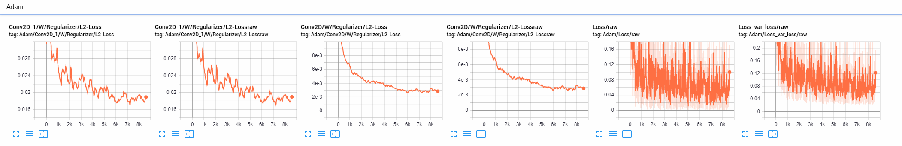
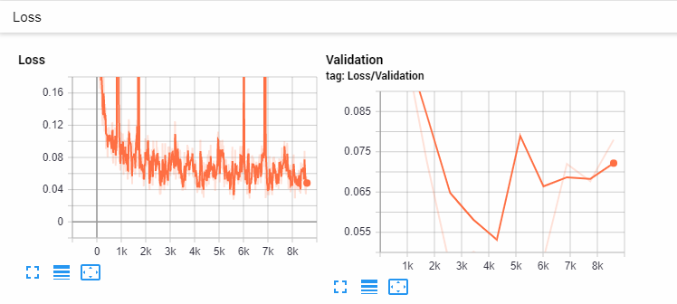

# TFLearn
I create a simple CNN to classify MNIST dataset using TFLearn. I use two convolution layers with small sized kernels (3 X 3), RELU activations, L2 regularizer, followed by max pooling. I then have two fully connected layers, with the first having a dropout with drop probability of 20% and a RELU activation, and the second having a softmax activation for the ten classes. I use cross entropy loss and Adam optimizer. 

The model achieves a test accuracy of 98.14% after 10 epochs.

I also show the easy integration of TFLearn with tensorboard, here are a few generated visualizations:

